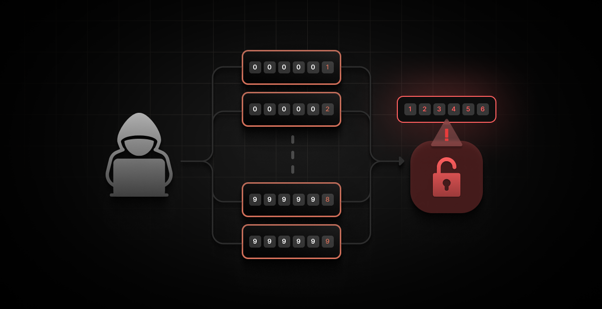
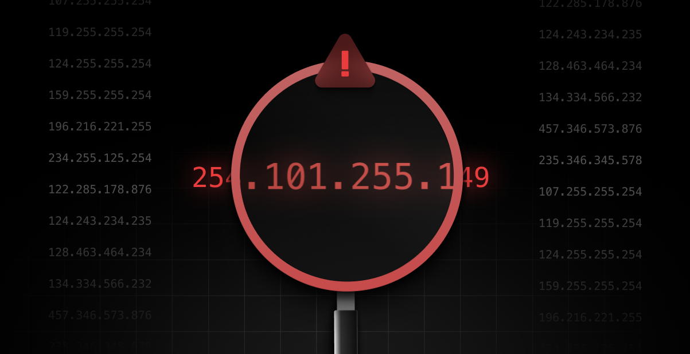
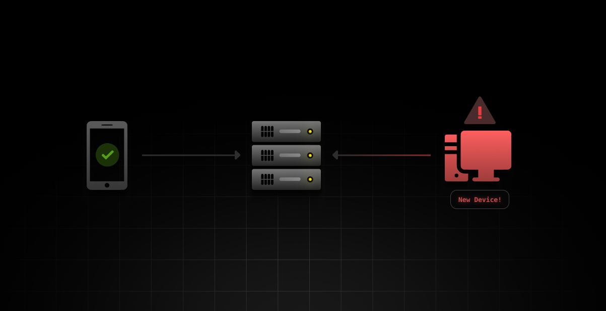
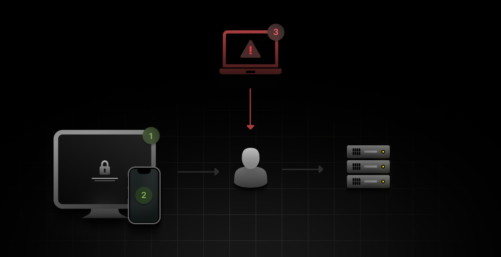

## Table of Contents

- [Introduction](#introduction)
- [What is Anomaly Detection?](#so-what-is-anomaly-detection)
- [1. Brute Force Attack Detection](#1-brute-force-attack-detection)
- [2. Password Breach Detection](#2-password-breach-detection)
- [3. Impossible Travel Detection](#3-impossible-travel-detection)
- [4. Bot Detection](#4-bot-detection)
- [5. Suspicious IP Detection](#5-suspicious-ip-detection)
- [6. New Device Detection](#6-new-device-detection)
- [7. Device Count Tracking](#7-device-count-tracking)
- [8. Requester Detection](#8-requester-detection)
- [Conclusion](#conclusion)

## Introduction

From fraudulent transactions and stealing sensitive data to wasting resources with denial of service, automated attacks have become one of the biggest attack vectors for applications on the web, and the need to safeguard against these attacks is more important than ever.

With the rollout of SuperTokens new Attack Prevention Suite of software, it’s a great time to explore some of these attack vectors and how SuperTokens new set of tools can safeguard against them.

## So what is Anomaly detection?

To answer the question, “Anomaly detection” is the process of analyzing data to find data points that don’t align with a standard data pattern and discover outlier behaviors. The SuperTokens attack prevention toolset detects user activities that deviate from baselines flagging outlier behavior and preventing account breaches before they can take place.

Let's take a look at some of the features of the toolset:

## Types of Anomaly Detection

### **1. Brute Force Attack Detection**

Brute force attacks involve trying various combinations of usernames and passwords until the correct one is found. One of the oldest existing methods that is still used, traditionally this method is slow but, when scaled to hundreds of thousands of bots each sending thousands of credentials checks, it can lead to compromised accounts.

For instance, in 2020, a [brute force attack on the music streaming service Spotify](https://www.bleepingcomputer.com/news/security/over-300k-spotify-accounts-hacked-in-credential-stuffing-attack/) led to the exposure of 300,000 accounts. Without detection mechanisms, attackers could have gained access to many more accounts, potentially compromising personal information like email addresses, payment details, and listening history.

[SuperTokens Brute Force Attack Detection](https://supertokens.com/docs/attackprotectionsuite/introduction#brute-force-attack-detection) feature tracks the number of multiple failed login attempts or password resets in a short period. The system will block further attempts to prevent malicious actors from gaining access to sensitive accounts, particularly when users use weak or common passwords.

### **2. Password Breach Detection**

Despite the issues associated with password-based authentication it still tends to be the most popular type of authentication mechanism. As mentioned in our [blog about MFA](https://supertokens.com/blog/benefits-of-multi-factor-authentication) using compromised passwords can be a huge security breach. Despite this many users will reuse passwords across multiple services. When one of these services suffers a breach, attackers often use the leaked credentials to attempt logins on other platforms (credential stuffing).

In 2019, the ["Collection #1" breach](https://en.wikipedia.org/wiki/Collection_No._1) saw over 773 million email addresses and passwords exposed. Attackers used this data to attempt login attempts on other services, leading to account takeovers, identity theft, and financial loss. Companies without password breach detection were particularly vulnerable.

[SuperTokens Password Breach Detection ](https://supertokens.com/docs/attackprotectionsuite/introduction#password-breach-detection)cross-references potential user passwords with known leaked password databases. This way SuperTokens can proactively alert users to update compromised passwords, ensuring that they don't remain vulnerable,

### **3. Impossible Travel Detection**

When a user logs in from two geographically distant locations within a short period, it's unlikely to be a legitimate action, as physical travel between the two points would be impossible.

Account takeovers due to impossible travel have affected industries like banking and e-commerce. In 2021, online retailer Overstock saw a rise in fraudulent purchases because of attackers logging in from different continents within minutes. These logins bypassed weak security checks, resulting in significant financial losses and customer trust damage.

[SuperTokens Impossible Travel Detection](https://supertokens.com/docs/attackprotectionsuite/introduction#password-breach-detection) helps mitigate this by monitoring login locations and flagging suspicious activity. If the system detects an impossible travel event, it can prompt additional security measures to prevent account takeovers and unauthorized access. 

### **4. Bot Detection**

Malicious bots automate harmful activities like credential stuffing (repeated login attempts using stolen passwords), account takeover attempts, or scraping sensitive data from websites.

In 2019, the gaming platform Fortnite faced large-scale credential stuffing bot attacks, leading to hundreds of thousands of compromised accounts. Attackers stole in-game purchases and user data. Without bot detection systems in place, the financial and reputational damage from such attacks can be immense.

SuperTokens uses behavioral analysis and advanced algorithms to detect and block bots before they can cause damage, ensuring human users aren’t affected.

### **5. Suspicious IP Detection**

Malicious actors often use tools like VPNs, TOR, or proxy servers to hide their location and identity, bypassing regional restrictions or trying to commit fraud.

In 2020, a large-scale attack on financial institutions using compromised VPNs led to fraudulent wire transfers amounting to millions of dollars. The attackers masked their locations and IPs using proxy servers, which went undetected due to weak IP detection mechanisms.

By flagging suspicious IPs known for fraudulent activities, SuperTokens helps prevent unauthorized access from high-risk sources, improving security for end-users.

### **6. New Device Detection**

When a user logs in from a new or previously unseen device, it could signal an unauthorized attempt to access the account.

In 2021,[attackers exploited mobile banking apps](https://www.nerdwallet.com/article/banking/banking-apps-security) by logging into accounts from new devices and using password resets to bypass security, resulting in the theft of funds and personal data. Many of these breaches could have been avoided with stronger device detection.

[SuperTokens' New Device Detection](https://supertokens.com/docs/attackprotectionsuite/introduction#password-breach-detection) helps prevent such attacks by flagging logins from unfamiliar devices and triggering additional verification steps, such as multi-factor authentication (MFA). This ensures that unauthorized parties cannot easily access user accounts, adding a crucial layer of protection.

### **7. Device Count Tracking**

Tracking the number of devices linked to a user account can be crucial for identifying unusual behavior. For instance, if a user who normally logs in from one or two devices suddenly accesses the account from several new devices, it might signal a security breach.

In[ 2020, several e-commerce platforms experienced account takeover attacks](https://www.infosecurity-magazine.com/news/ato-outpace-ransomware-top/) where hackers logged in from multiple new devices, leading to fraudulent purchases and financial losses. These incidents could have been prevented by tracking and flagging suspicious device activity.

[SuperTokens' Device Tracking](https://supertokens.com/docs/attackprotectionsuite/introduction#password-breach-detection) feature monitors the number of devices associated with each account, alerting users or administrators to potential risks. Identifying unusual usage patterns helps prevent unauthorized access and account takeovers.

### **8. Requester Detection**

Some attackers attempt to evade detection by spoofing device details or rapidly switching between different requesters to mask their identity.

[In 2021, for example, an airline’s loyalty program faced a large-scale fraud attack](https://www.cloudsek.com/blog/miles-away-from-safety-the-frequent-flyer-fraud) where attackers used disguised devices to repeatedly access accounts, stealing points and rewards. Traditional security measures struggled to recognize these spoofed devices, enabling prolonged unauthorized access.

SuperTokens addresses this issue by recognizing and remembering device and requester details, even when masked. This ensures that malicious actors cannot continuously attempt attacks without being flagged. By detecting these advanced tactics, SuperTokens helps prevent breaches, fraud, and the erosion of user trust, offering robust security for businesses and users alike.

## Conclusion

SuperTokens’ Anomaly Detection suite offers a robust, proactive defense mechanism against a wide array of threats, including brute force attacks, password breaches, and more.

Businesses can stay ahead of attackers, significantly reducing the risk of breaches, fraud, and the loss of user trust. SuperTokens’ comprehensive approach not only enhances security but also ensures that legitimate users can continue to access their accounts without friction. As automated attacks evolve, having an intelligent, adaptable defense like is key to maintaining the integrity and security of modern web applications.