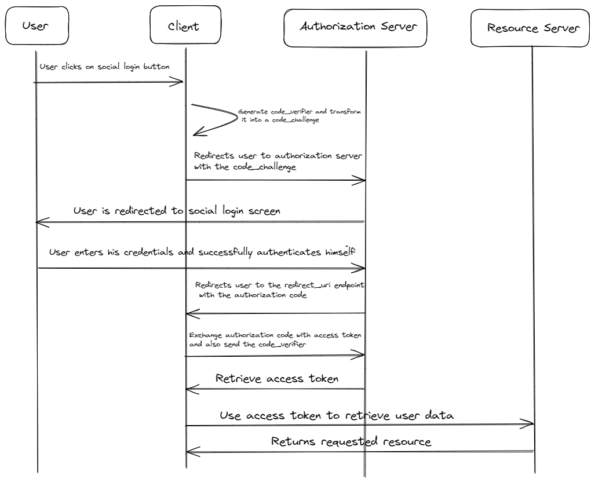

In the authentication space, password based authentication is considered to be the least secure. Most users tend to reuse passwords and not use password managers. This is why [federated identity](https://en.wikipedia.org/wiki/Federated_identity) has gain an increase in popularity in the last decade. OAuth is a a protocol that enables identity federation allowing applications and is key enabling the social login flows we interact with on a daily basis. Although it is very popular, there are a few critical concerns around OAuth and OAuth with Authorization Code flow. This is where Authorization Code flow with Proof Key for Code Exchange comes in.

## What are the security concerns with OAuth?

The authorization code grant flow in OAuth 2.0 is actually quite secure.

In this method, after the user is redirected from the client server and authenticates with the authorization server an authorization code is given to the user. The client server exchanges the authorization code with the client id and secret to receive an access token.

This is fine for most web applications which have a backend server and the client id and client secret are not exposed. The problem comes up with embedded systems and mobile applications. In these cases the client id and client secret can be exposed. This means that if the authorization code is intercepted by an attacker, they can now generate an access token and request information about the user.

## How does PKCE solve this issue?

The problem with authorization code flow, as mentioned above, is that the client secret and client id can be accessed on public clients(de-compiled from mobile apps or embedded systems). PKCE tackles this problem by getting rid of client secrets all together. Instead when the user gets redirected to the identity server, the public client also generates a unique code called a `code_verifier` and from it generates a `code_challenge` which is sent to the identity server. After the identity server verifies the user, it will store the `code_challenge` and issue an authorization code. Now when the client goes to exchange the authorization code for an access token, they will also need to send along the `code_verifier` which will be validated by the identity server against the stored `code_challenge` before it issues an access token. This way even if an attacker intercepts the authorization code, they will not be able exchange it for an access token since they do not have the `code_verifier`.

## How does PKCE work?

Authorization Request: The client application initiates the authentication process by redirecting the user to the authorization server. The client includes specific parameters such as the response_type set to "code", client_id, redirect_uri, and scope to define the requested permissions.

User Authentication: The user interacts with the authorization server to authenticate themselves and grant permission to the client application.

Authorization Grant: Upon successful authentication, the authorization server issues an authorization code to the client application via the specified redirect URI.

PKCE Challenge Creation: Before exchanging the authorization code for an access token, the client generates a cryptographically random string called a Code Verifier and transforms it into a Code Challenge using a specified method such as SHA-256.

Token Exchange: The client sends the authorization code along with the Code Verifier to the authorization server to exchange them for an access token. The server verifies the code, along with the Code Verifier, ensuring that the client initiating the token exchange is the same one that initiated the authorization request.

Access Token Issuance: Upon successful verification, the authorization server issues an access token to the client application, allowing it to access protected resources on behalf of the user.

## What are the problems PKCE solves

## Conclusion

What Problems Does it Solve?
The Authorization Code Flow with PKCE addresses several security vulnerabilities present in the traditional Authorization Code Flow, particularly in scenarios where clients are incapable of maintaining the secrecy of their client secrets. Some of the key problems it solves include:

Code Interception: In the standard Authorization Code Flow, malicious actors can intercept the authorization code during transmission between the authorization server and the client. PKCE mitigates this risk by introducing the Code Verifier, which is only known to the client.

Code Injection: Attackers may attempt to inject rogue code to intercept the authorization code during the redirect process. PKCE prevents this by requiring the verifier and the code challenge to match, ensuring that the code exchange is legitimate.

Client Secrecy: Unlike the traditional flow, PKCE eliminates the need for clients to store sensitive credentials such as client secrets securely.

Changes Compared to OAuth
The primary change introduced by PKCE lies in the addition of the Code Verifier and Code Challenge parameters. These parameters ensure that even if an attacker intercepts the authorization code, they cannot exchange it for an access token without the corresponding Code Verifier, significantly enhancing the security of the authentication process.
 
In conclusion, the adoption of the Authorization Code Flow with PKCE represents a significant step forward in the quest for secure and reliable user authentication and authorization mechanisms in modern web applications. Its deployment can help organizations bolster their security defenses, safeguard user privacy, and foster trust in the digital ecosystem.