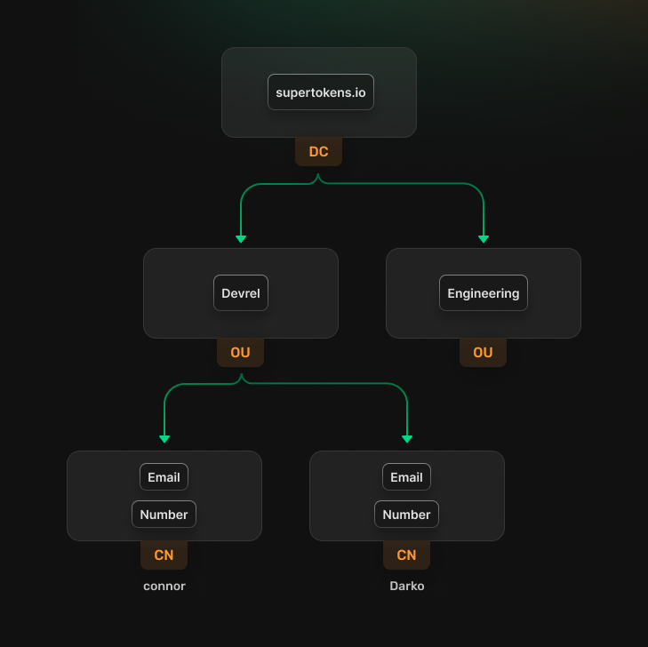

## Table of Contents

1. [What is LDAP?](#what-is-ldap)
2. [How does LDAP work?](#how-does-ldap-work)
3. [3 Practical Examples of LDAP in Action](#3-practical-examples-of-ldap-in-action)
4. [How does LDAP compare to other services?](#how-does-ldap-compare-to-other-services)
5. [How to Implement LDAP](#how-to-implement-ldap)
6. [Conclusion](#conclusion)

## What is LDAP?

LDAP is the Lightweight Directory Access Protocol, a protocol for network devices to communicate with Directory Services. A Directory Service is a database containing information on all of your users, groups, and network devices. When most people are talking about LDAP, they aren’t talking about the LDAP protocol, but moreso Directory Services that use the protocol. It is based off of the DAP protocol released in the X.500 standard in 1988.

Back in the 1980, standards were still being released on how different network services should be handled. The International Telecommunication Union Telecommunication Standardization Sector (what a name), called the ITU for short, had just released the X.400 standard for managing email services. The X.400 handled sending email very differently than the SMTP standard we’re used to today, and there was confusion with the X.400 standard on how “email addresses” were formatted. They were formatted in a way that somewhat represented physical mail, but it was very unclear which fields were required and which fields weren’t, and any mistakes in the address caused an email to not be sent. 

This led the ITU to make the X.500 standard for Directory Services. The X.500 server was a single public directory that senders could use to find an organization member if they had chosen to upload their directory to the service. It worked like a phonebook, saving user information and making it searchable with formatting similar to the X.400 mailing addresses. Now someone just needed your organization and name to send you mail. But it was completely public facing and had no anonymity. The internet wasn’t as public then, so many people using email were government officials and businessmen who didn’t want their information out in the open. And the X.500 was just as confusing to use as the X.400 was.

So Tim Howes - yes, the same Tim Howes that was Directory Server Architect at Netscape, created Rockmelt, and was Director of Engineering at Facebook/meta for AI infrastructure - got with a group of colleagues at the University of Michigan and create LDAP - the Lightweight Directory Access Protocol. Now, instead of installing all of X.500, you could install something lightweight and map and manage all of your network devices and users. It was officially published in 1993 and there was much rejoicing.


### How does LDAP work?

LDAP works by making an information tree of resources on the network, just like directories on your computer. The root, which is the Directory Service, is called the Domain, and its children are called Organizational Units. Examples of Organizational Units are a Users folder, a Network Devices folder, or a Groups folder. The children of Organizational Units are called Common Names. Common Name examples are the users in the users folder, individual computers or network devices in the computer folder, and usergroups inside the group folder.



Domains can be connected together as long as they share the same schema. When multiple Domains containing trees are connected together, it’s called a Forest. How clever.

You can search through the different nodes in the domains using an LDAP query - which is still formatted similar to X.400’s email addresses. Here’s an example of an LDAP query:

`"CN=Connor Peshek,OU=Devrel,DC=supertokens,DC=io"`

The DC, OU, and CN are the Domain Controller, Organizational Unit, and Common Name like we talked about above. In this example, you’d be searching the Domain supertokens.io for the Devrel group and finding Connor Peshek and would get back a pretty cool guy's email, phone number, and other stored information.

LDAP queries are notoriously fast, with some people claiming it to retrieve data in half the time of a classic database like mysql. This is another reason people are a fan of LDAP directories. However, it does tend to have slower write speeds.

LDAP uses plain text by default, but supports SSL and TLS. LDAP authentication can be handled by storing the hashed password of a user inside their LDAP directory. Although there are other ways that LDAP authentication can be handled and we’ll touch on that a bit later.

### 3 Practical Examples of LDAP in Action

There are many use cases for using an LDAP server. A couple of examples include:

1. The head of IT wants to be able to access the computers of all of the members of the IT department. He has parent permissions over the members devices so he can easily add and offboard IT employees while controlling their network permissions
2. An company wants to only allow designers access to Adobe Photoshop
3. An office wants the printer in the middle of the office to be accessible by everyone on the network so they can print out the cover sheet for those TPS reports


## How does LDAP compare to other services?

Since LDAP servers store an organization's members in an easy to find way with permissions attached, it works very well as an Identity Provider for Oauth or SAML services. In many respects, it’s not too different from many Identity and Access Management tools that we have today and can easily be used as part of a [multi-factor identification](https://supertokens.com/blog/benefits-of-multi-factor-authentication/) configuration.


### LDAP vs Active Directory

Active Directory is Microsoft’s implementation of LDAP. It allows you to set a Domain Server that has full control of every node in its network tree. It will automatically manage DHCP and DNS for devices in its network. Microsoft has a way of taking things and making them their own - [like trying steal Java from SUN and getting sued in 1997](https://www.nytimes.com/1997/10/08/business/sun-sues-microsoft-on-use-of-java-system.html) - and they did something similar, although not nearly as sinister, with LDAP. They made a Directory Service that utilized LDAP called Microsoft Active Directory, and it’s now so strongly associated with LDAP that it’s hard to not talk about it when mentioning LDAP. But since LDAP is just a protocol, and Active Directory is proprietary software built by Microsoft, it isn’t really stealing (this time). In fact, there are open source alternatives like OpenLDAP that are popular in linux environments.

Active Directory is now mainly used for on-prem networks. There is a cloud-based offering for Active Directory, formerly known as Azure AD - now known as Microsoft Entra ID.

### LDAP vs Kerberos

Kerberos is a network authentication protocol made by MIT in 1988. It’s known for being used inside of Microsoft Active Directory as an authentication layer. A user reaches out to a Key Distribution Center (which in Active Directory’s case, is also the Domain Controller/Directory Service) and authenticates themselves. They are then given a Ticket-Granting-Ticket (TGT) to access other services (like file systems inside of Active Directory) inside the network. The TGT is encrypted and the service has a key to decrypt the ticket and authenticate the user. You can think of it like this. The LDAP database contains all the authorizations the user has, and Kerberos can use this information to make secure authentication tickets for the user to be used by the service. In this way, Kerberos can be used to implement Single sign-on inside of Active Directory.

### LDAP vs Single Sign-on (SSO)

Single sign-on is an authentication method where a user signs in at one location and can be authenticated in multiple places. [It’s one of many authentication methods available today](https://supertokens.com/blog/types-of-authentication). LDAP servers are often used to integrate with Single sign-on systems due to its existing information on users and permissions. It’s very easy to configure Active Directory - or Entra ID - as a Service Provider for an OpenID Connect application.

### How to Implement LDAP

You can Implement LDAP by using it as an Identity Provider for a platform like SuperTokens. [SuperTokens is an authentication and authorization platform](https://supertokens.com/product) that you can use to manage logins in your application. We’ll walk through an example of setting up Microsoft Entra ID as an Identity Provider.

#### Create an app in Microsoft Entra

Head to the [Microsoft Entra homepage](https://entra.microsoft.com/#home). On the left sidebar, click Applications -> App Registration -> Create a New Registration. When it asks for a Redirect URI, use `web` for the platform and the following for your URI:

`http://localhost:3000/auth/callback/entra`

Under supported account types, you'll be asked if you want to handle single tenant, multi-tenant, or personal accounts. This will depend on your use case:

Single tenant - making an internal tool and only want people in your organisation to be able to use this application.
Multi-tenant - making a tool for corporate users that allows others to login with their Entra ID account.
Common - allows anyone with any microsoft account to log in (xbox, skype, etc)

Select whichever use case is right for you.

It will redirect you to a new page containing your Client ID (also referred to as an Application ID). If you aren’t redirected to this page, then you can click security -> permissions -> app registration -> overview in the new left hand tab.


Click on Authentication on the left hand side. Under the section "Implicit grant and hybrid flows", select the option:

`ID tokens (used for implicit and hybrid flows)`

And then save at the bottom.

Save your Client ID and click “Certificates and Secrets” on the left side of the screen. Create a new Client Secret. Copy the Client Secret Value - and not the Client Secret ID - for use later in the application.


Finally, click Overview -> endpoints at the top of the page. Copy the `OpenID Connect metadata document` url for later.

### Generate a SuperTokens Project

Run `npx create-supertokens-app@latest --recipe=thirdparty` to make a new SuperTokens project.

We need to configure the front-end to generate a “Login with Entra” button, so add the following to your front-end `config.tsx`.

```typescript
ThirdParty.init({
    signInAndUpFeature: {
        providers: [
            Google.init(),
            {
                // The ID sets your callback url
                // ie http://localhost:3000/auth/callback/entra
                id: "entra",
                name: "Entra", // Will display "Login with Entra"
                // optional
                // you do not need to add a click handler to this as
                // we add it for you automatically.
                buttonComponent: (props: {name: string}) => <div style={{
                    cursor: "pointer",
                    border: "1",
                    paddingTop: "5px",
                    paddingBottom: "5px",
                    borderRadius: "5px",
                    borderStyle: "solid"
                }}>{"Login with " + props.name}</div>
            }
        ],
    },
}),
```

Now we need to configure the back-end to handle the OIDC calls. We'll set our scopes to `["openid", "email", "profile"]` and our `oidcDiscoveryEndpoint` to the OpenID Connect metadata document we got in our application overview.

Add the following to your `config.ts`

```typescript
ThirdParty.init({
    signInAndUpFeature: {
        providers: [
            {
                config: {
                    thirdPartyId: "entra",
                    name: "Entra",
                    clients: [{
                        clientId: "<CLIENT_ID>",
                        clientSecret: "<CLIENT_SECRET_VALUE>",
                        scope: ["openid", "email", "profile"]
                    }],
                    oidcDiscoveryEndpoint: "https://login.microsoftonline.com/common/v2.0/.well-known/openid-configuration",
                    userInfoMap: {
                        fromUserInfoAPI: {
                            userId: "sub",
                            email: "email",
                        }
                    }
                }
            },
        ],
    },
})

```

Run `npm run start` and head to `localhost:3000` in the browser. You’ll see the option `Login with Entra`. Click it and you’ll get a session signed in from Entra ID. How easy was that?

## Conclusion

LDAP is a time tested, fast, and convenient way to store users and permissions. Its ability to integrate as an Identity Provider makes it valuable, especially to large organizations that have lots of users and permissions to manage. If you want to look into integrating LDAP as an SSO provider into your application, why not [Enhance your Authentication with SuperTokens](https://supertokens.com/product).
